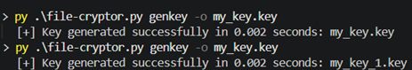
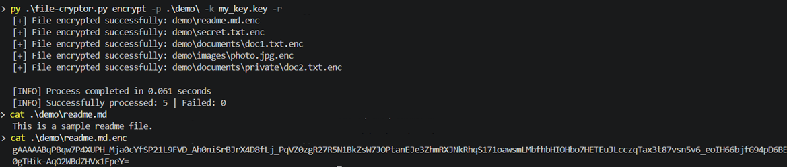

# local-file-cryptor


Lightweight CLI tool for local file encryption and decryption using Fernet symmetric encryption.

## Features

- **Symmetric Encryption**: Uses Fernet for authenticated encryption.
- **Recursive Directory Support**: Encrypt/decrypt entire folder structures while preserving hierarchy (`-r`).
- **Atomic Inplace Mode**: Safely overwrites original files using temporary files to prevent data corruption (`-i`).
- **Secure Key Management**: Generates 32-byte base64 keys and automatically restricts file permissions (`chmod 600`).
- **Flexible Output**: Custom output paths (`-o`), inplace overwriting, or default `.enc` extension.
- **Robust Error Handling**: Gracefully handles race conditions, permission errors, invalid keys, and memory limits.
- **Automation Ready**: Quiet mode (`-q`) and standard exit codes (`0` for success, `1` for failure).

---

## How it works

- **Key Generation**: Generates a cryptographically secure 32-byte key.
- **File Processing**: Reads files in binary mode to support any file type (text, images, binaries).
- **Encryption**: Uses Fernet (AES + HMAC) for authenticated encryption.
- **Atomic Writes**: In inplace mode, writes to a `.tmp` file first. Only if successful, it replaces the original file, ensuring zero data loss on crashes.
- **Integrity Check**: Fernet verifies integrity before decryption using HMAC.

---

## Requirements

- Python 3.6+
- `cryptography` library

---

## Installation

```bash
git clone <your-repo-url>
cd local-file-cryptor
pip install cryptography
```

---

## Examples

### Generate a new encryption key

```bash
python file-cryptor.py genkey -o my_secret.key
```

### Encrypt a single file

```bash
python file-cryptor.py encrypt -p secret.txt -k my_secret.key
```

### Decrypt a file

```bash
python file-cryptor.py decrypt -p secret.txt.enc -k my_secret.key
```

### Encrypt a directory recursively

```bash
python file-cryptor.py encrypt -p ./documents/ -k my_secret.key -r
```

### Encrypt inplace (overwrites original)

```bash
python file-cryptor.py encrypt -p secret.txt -k my_secret.key -i
```

### Quiet mode

```bash
python file-cryptor.py encrypt -p secret.txt -k my_secret.key -q
```

---

## Known Limitations

- **Memory Usage:** Large files exceeding available memory may cause failure or slowdowns due to full in-memory loading.
- **Key Responsibility:** Losing the .key file means permanent data loss. There is no "forgot password" recovery.
- **Path Resolution**: Directory structure preservation may be lost when path resolution cannot map files back to the original base directory (e.g. symbolic links or cross-drive copies like C: to D:).

---

## Future Improvements

- [ ] Streaming encryption (chunking) for multi-gigabyte files without high RAM usage using `cryptography.hazmat`.
- [ ] Progress bar with ETA and throughput calculation.

---

### Key Generation

Generating a new key. Running the command again automatically creates a numbered key (`my_key_1.key`) to prevent accidental overwriting.



### Recursive Directory Encryption

Encrypting an entire directory structure (`demo/`) while preserving the subfolder hierarchy (`documents/private/`).



### Error Handling

Attempting to decrypt with an incorrect key. The tool fails gracefully, displaying a clean error message.

.png)

---

## ⚠️ Disclaimer
This tool is provided for authorized security testing, personal data protection, and educational purposes.

    - Only use this tool on files you own or have explicit permission to encrypt.
    - The author is not responsible for any data loss caused by lost keys or misuse of the --inplace flag.

Use responsibly.